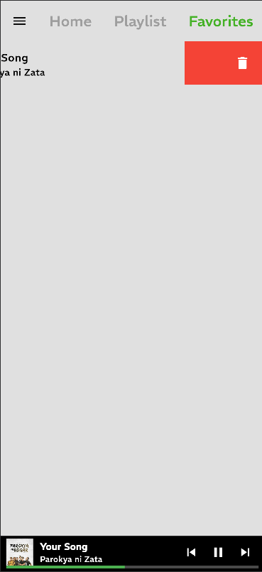

# spottyplay
A simple music player app using flutter.


# Music Player App

This is a simple Music Player App built with React and Lottie animations.

Features

- Play and pause music
- Display Lottie animations
- Responsive design

 Installation

1. Clone the repository:
    ```bash
    git clone https://github.com/yourusername/Music-Player-App.git
    cd Music-Player-App
    ```

2. Install dependencies:
    ```bash
    npm install
    ```

3. Start the development server:
    ```bash
    npm start
    ```

 Usage

- Open your browser and navigate to `http://localhost:3000`.
- Use the controls to play and pause music.
- Enjoy the Lottie animations integrated into the app.

 File Structure

- `src/components/Drawer.js`: Contains the Drawer component with Lottie animation.
- `src/assets/animation.json`: Contains the Lottie animation data.
- `android/gradle/wrapper/gradle-wrapper.properties`: Configuration for Gradle wrapper.

 Dependencies

- React
- Lottie
- npm

 Screenshots

 Animation Intro


 Home


 Musics


 Favorites


 Song Panel


Delete Song In Favorites

 Contributing

1. Fork the repository.
2. Create a new branch (`git checkout -b feature-branch`).
3. Make your changes.
4. Commit your changes (`git commit -am 'Add new feature'`).
5. Push to the branch (`git push origin feature-branch`).
6. Create a new Pull Request.

 License

This project is licensed under the MIT License.
